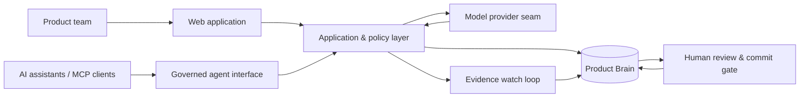

# pm.gold

### The governed system of record for product decisions

**Live:** [pm.gold](https://pm.gold)  
**Source:** Private  
**Stage:** Active · design-partner stage

> Product decisions need more than an agent. pm.gold preserves the evidence behind a decision, who approved it, what changed, what shipped, and whether the assumptions underneath it still hold.

## The Problem

AI assistants are increasingly capable of researching, drafting, planning, and executing product work. But a conversation is not an organizational record.

Teams still need durable answers to questions like:

- Why did we make this decision?
- What evidence supported it?
- Who approved it?
- Did implementation match intent?
- Have the assumptions underneath it changed?
- What did we learn the last time we made a similar decision?

pm.gold is designed as the durable governance and intelligence layer underneath whichever AI tools a team chooses to use.

## What I Built

- A **typed product decision graph** connecting evidence, signals, decisions, PRDs, risks, objectives, actions, experiments, and outcomes.
- **Append-only versioning** so history is preserved rather than silently rewritten.
- A **human commit gate**: AI can propose; a human approves what becomes organizational record.
- **Evidence-grounded generation** where supported claims retain citations and unsupported sections remain visible as gaps.
- A **Contradiction Ledger** that identifies decisions still resting on older evidence when the underlying source changes.
- **Assumption watches** and an interrupt budget so the system can monitor important evidence without becoming an alert machine.
- **Permission-faithful retrieval** so an agent cannot retrieve information its human principal is not entitled to see.
- An **MCP interface** that lets external assistants query governed knowledge and submit proposals without gaining an approval capability.
- Governance metrics designed to keep “unknown” distinct from “zero” rather than manufacturing flattering certainty.

## Architecture at a Glance

### Public-safe stack summary

- Next.js / React / TypeScript
- Supabase Postgres + pgvector
- Model-provider abstraction across frontier AI providers
- MCP for governed external-agent access
- Vercel deployment
- Transactional notification infrastructure

## Engineering Principles

### 1. Agents propose; humans commit
The system is designed so the AI execution path does not possess a hidden “approve” capability. Approval is a governance boundary, not a UI preference.

### 2. The record is append-only
A material change creates a new version. Historical decisions remain inspectable in the state in which they were actually made.

### 3. Tenant isolation fails closed
Workspace context and permissions are derived server-side; missing or invalid context should return less, not more.

### 4. Evidence is part of the object
A decision without its supporting evidence is not equivalent to a decision with evidence. The graph keeps those relationships explicit.

### 5. The model is replaceable; the record is durable
Models improve quickly. Organizational memory should not require a migration every time the preferred model changes.

## Selected Engineering Narratives

- Building a human-governed proposal/commit boundary that remains enforceable even as more agent surfaces are added.
- Designing permission propagation so derived artifacts cannot become more visible than the evidence they depend on.
- Treating evidence drift as a queryable record problem instead of asking an LLM to guess whether an old decision is still valid.
- Creating an interrupt budget so monitoring remains useful rather than becoming noise.
- Building deployment and security checks around properties that can fail silently: cross-tenant behavior, public-role grants, scheduled jobs, and connector ACL widening.

## Development Activity

The activity badge is generated from the private repository and publishes aggregate counts only.

## What Is Intentionally Not Public

- Application source code
- Database schema and migrations
- Authentication/session implementation
- Internal API routes and infrastructure topology
- Proprietary prompts, evaluation datasets, and agent policies
- Customer or design-partner data
- Security-sensitive implementation details

## My Role

Product strategy · system architecture · AI architecture · governance model · UX direction · implementation · security review · testing strategy · production operations

---

**Private implementation. Public architecture. Verifiable product.**